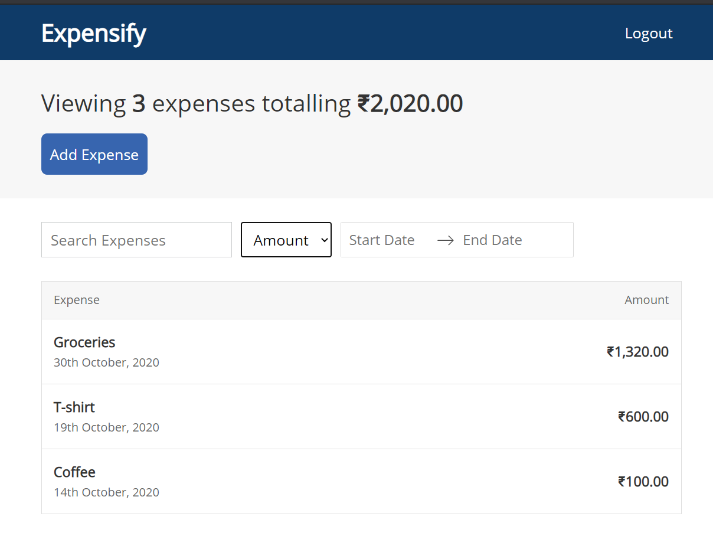

<h1 align="center">Expensify</h1>
<div align="center">
  <h3>
    <a href="http://expensify.rarchitgupta.com/">
      Demo
    </a>
  </h3>
</div>

<!-- TABLE OF CONTENTS -->

## Table of Contents

- [Overview](#overview)
  - [Built With](#built-with)
- [How to use](#how-to-use)
- [Contact](#contact)

<!-- OVERVIEW -->

## Overview



A expenses and budget management app which uses Google Login for authentication.

### Built With

<!-- This section should list any major frameworks that you built your project using. Here are a few examples.-->

- [React](https://reactjs.org/)
- [Redux](https://redux.js.org/)
- [Jest](https://jestjs.io/)
- [Enzyme](https://github.com/enzymejs/enzyme)
- [Firebase](https://firebase.google.com/)

## How To Use

<!-- For example: -->

To clone and run this application, you'll need [Git](https://git-scm.com) and [Node.js](https://nodejs.org/en/download/) (which comes with [npm](http://npmjs.com)) installed on your computer. From your command line:

```bash
# Clone this repository
$ git clone https://github.com/rarchitgupta/expensify

# Install dependencies
$ npm install

# Run the app
$ npm start
```

## Contact

- GitHub [@rarchitgupta](https://{github.com/your-usermame})
- LinkedIn [Archit Gupta](https://www.linkedin.com/in/rarchit-gupta/)
